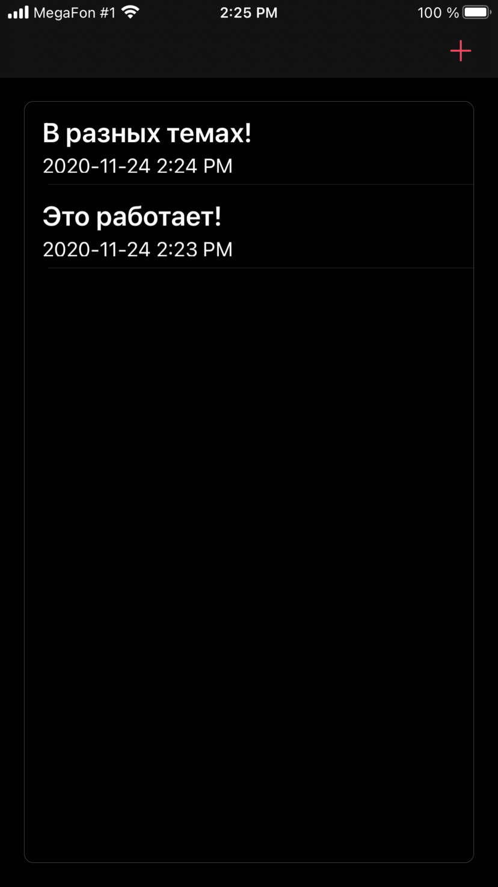
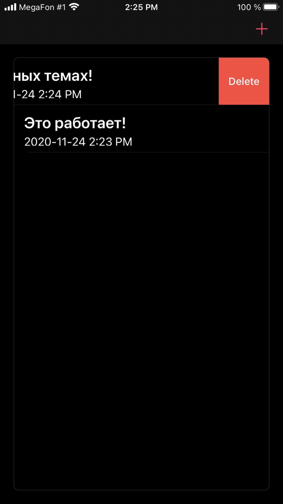

# Notes

This app is completely my work. 
Application supports Core Data. All your notes will be saved.
Application also supports two appearances (light and dark). 

{:height="400px" width="200"}

# Using

